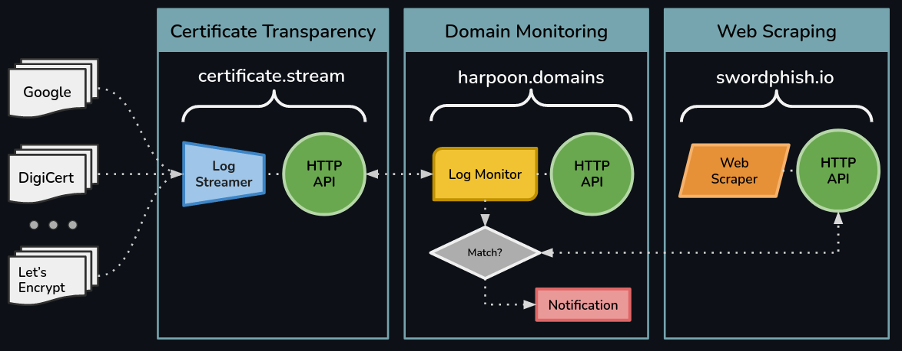

# Documentation

Welcome to Villain's interactive API documentation.

If you haven't already, <a href="https://auth.villain.network/signup?client_id=4jj7baft9iisgeppfpblhpauiv&response_type=code&scope=aws.cognito.signin.user.admin+email+openid&redirect_uri=https%3A%2F%2Fapi.villain.network%2Foauth2%2Fcallback">sign up</a> and create a Project. Once you have a project, you can use the Client "ID" and "Secret" associated with your project for authentication and using the Villain API services.

All of Villain's API services have <u>free tier support</u>, so getting started is an easy, worry-free experience.

## Audience

This interactive API documentation is intended for software developers or cybersecurity engineers with basic to intermediate understandings of APIs. For managers who are interested in business-value related content, our [About page](https://villain.network/about/intro) contains information about Villain, domain monitoring, and end-to-end solutions highlighting <u>What</u> the Villain Toolkit can do rather than the technical aspects around <u>How</u>.

## Examples

> "I hear and I forget; I see and I remember; I do and I learn." — [a great quote with no clear origin](https://english.stackexchange.com/questions/226886/origin-of-i-hear-and-i-forget-i-see-and-i-remember-i-do-and-i-understand)

If you're the type of learner who prefers to jump into the deep end, there are plenty of examples on our [Tutorials Page](https://villain.network/docs/). In fact, the tutorials page may be the best place to get a high-level understanding of Villain API services and how each could be integrated into your application's blueprint. When you're ready to get into the specifics of each API, this set of documentation will be the place to do so.

## Services

The diagram below illustrates the relationships between Villain's API services. When used together these services are able to create a robust, end-to-end anti-phishing and domain monitoring workflows. However, each of these services is capable of acting entirely independent of one another. This allows the developer the freedom to pick and choose the API(s) that best fit their particular use-case without the need to completely redesign existing workflows.

