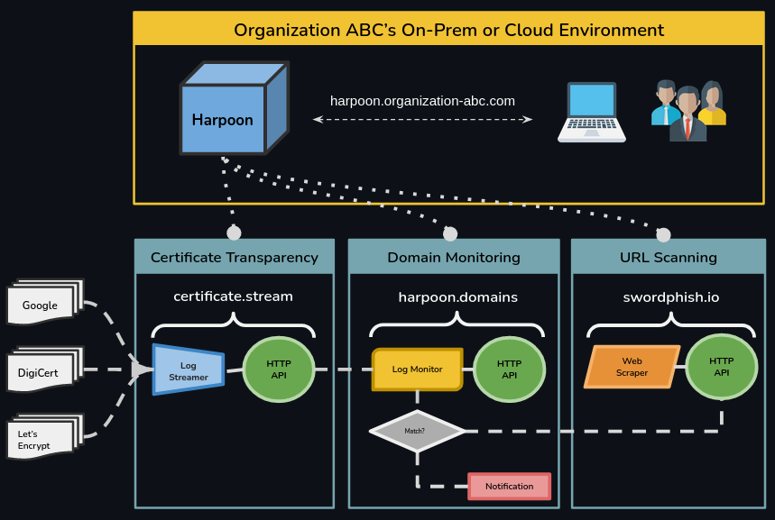
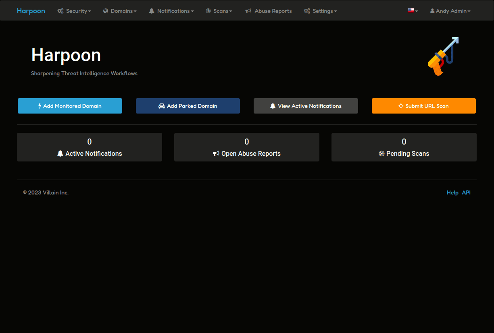
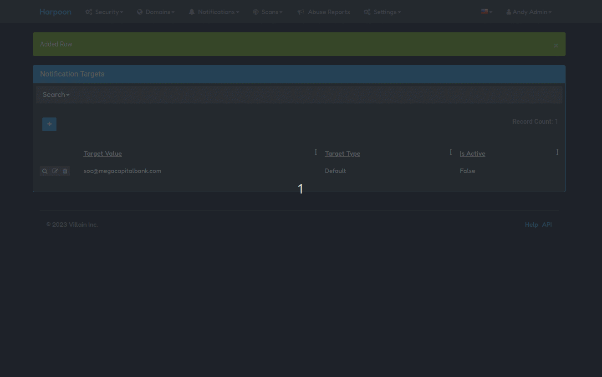
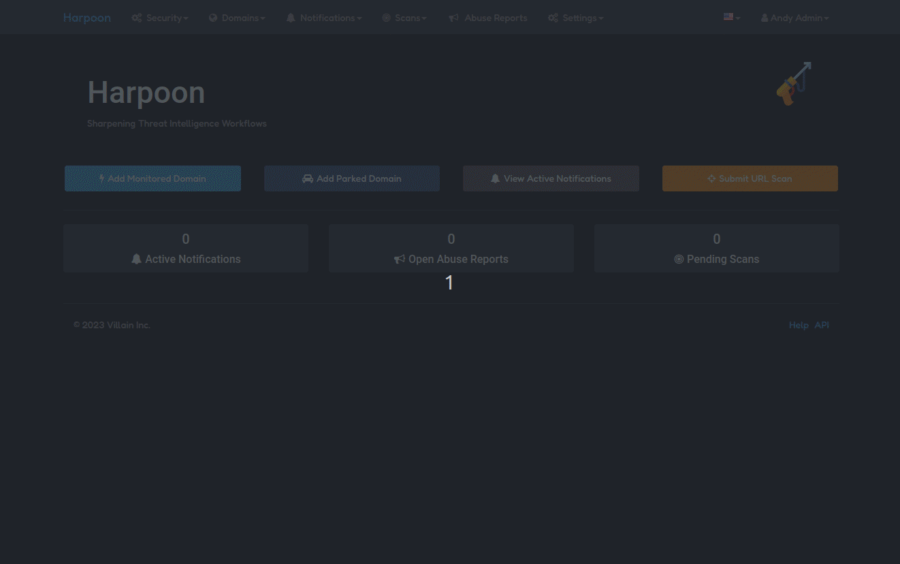
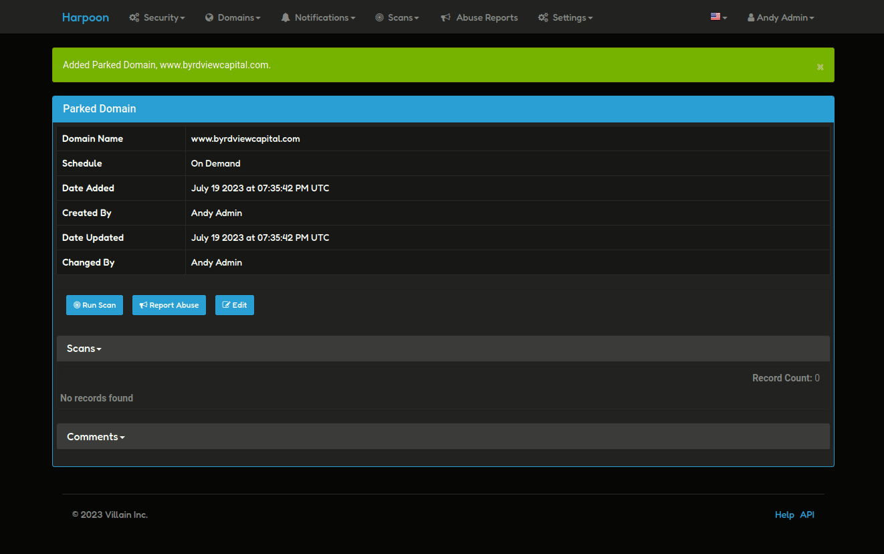
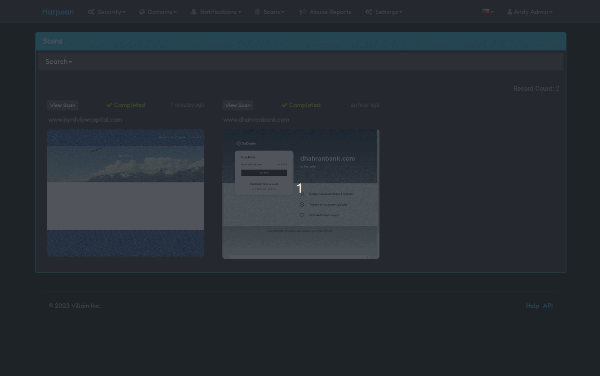

# Harpoon Domain Monitoring

<b>Need a production-ready, end-to-end Domain Monitoring solution <a href="#asset-monitoring-with-ai">powered by AI?</a></b>

Harpoon-Enterprise can sharpen your cybersecurity team's threat intelligence workflows.

## What is Harpoon-Enterprise?

### Overview

Harpoon-Enterprise extends the functionality of the [harpoon.domains]('/docs/introduction-2') API service while also integrating features from other Villain API Services — [certificate.stream]('/docs/introduction-1') and [swordphish.io]('/docs/introduction-3') — into a single user-friendly application that delivers an end-to-end robust, auditable, and efficient Domain Monitoring workflow.

Harpoon-Enterprise can ...

- Continuously monitor your organization's domain assets
- Notify your team when any new or known domains are "active"
- Regularly scan any matched or parked domain 
- Monitor domains for your organization's logo or other assets
- Help your team work with Registrars to take down malicious domains
- Keep your organization's brand and reputation safe

### High-level Architecture

The Harpoon-Enterprise software is a containerized solution that can be installed onto on-prem and cloud environments using automation tools and infrastrucutre-as-code. Harpoon-Enterprise's authentication layer can hook directly into your organization's OID or LDAP services to keep access federation simple. Cybersecurity analysts can manage day-to-day operations related to domain monitoring directly within the Harpoon-Enterprise user interface. Using the application is straightforward as seen in the Demo & Walkthrough section.

## Demo & Walkthrough

This demo goes into how to set up a simple domain mnitoring workflow with Harpoon. 

### Notification Targets

When something significant happens such as a similar domain name is found in the certificate transparency logs, an "in-active" parked domain becomes "active", or your organization's logo or webpage content is found on another host, Harpoon will generate a notification. Harpoon is will send notifications to a target that you create. As a tip, it’s best to leave the “active” option unchecked until you're comfortable with the amount of notifications that the application generates. 

### Live Monitoring

Next, add your company’s domain name under the “Live Monitoring” heading. Behind the scenes, Harpoon uses a variety of similarity metrics to compare your domain to the domains found in the certificate transparency logs. These values can be adjusted at any time to increase or decrease the number of notifications that you see. Default values are provided for you.

### Notifications

Once you've added a "Monitored Domain", Harpoon will now actively compare domain names found in the certificate transparency logs against your monitored domain. If any similarity metric thresholds are hit, a notification will be generated. From the "Active Notifications" view you will be able to see all "unacknowledged" notifications. You can drill down into a specific notification to view information like the matched domain name, the scoring details of how it was matched, and the actual certificate it was found in. Most importantly, if the name seems like a typosquat of your organization’s name, you can add it to “parked domains”. 

### Parked Domains & URL Scanning

Now that the domain is parked, it can be scanned. Scans are queued up and processed in the background, and so you can submit multiple at any time. Additionally, parked domains can be assigned a "Schedule" for automated scanning. 

After submitting the scan and letting it finish processing, you can view the results from the All Scans page. The Scan view is loaded with data extracted from this URL. Things like Screenshots, DNS records, WHOIS queries, HTTP traffic, and the page’s HTML are all viewable from this screen and can help you determine the true intentions of the given domain.

### Submitting Abuse Reports

Finally, if the similar domain seems like an active, credible threat to your organization, you can log an Abuse Report with the domain registrar using the information pulled from the scan. 

### Asset Monitoring with AI

What about scenarios where domain matching isn't enough? 

When simple word comparisons won't cut it, Harpoon uses Artificial Intelligence to fill the gap. The Harpoon platform is constantly scanning all "active" domains it finds in the Certificate Transparency Logs and updating its internal catalog with results from each scan.
With the help of Deep Learning, Harpoon can find websites that appear "similar" to your website. Specificalyl, Harpoon will check if the given website is using your organization's logo or if they have copied your website under a completely different domain name. 

## Contact

If you have any questions or are interested in using this product, please reach out to us at info@villain.network.

In most cases, our team can install Harpoon-Enterprise into your organization's cloud environment in about 4-6 weeks.

Need more information?

<a className="button button--primary button--lg" href="/">Schedule Demo</a>

