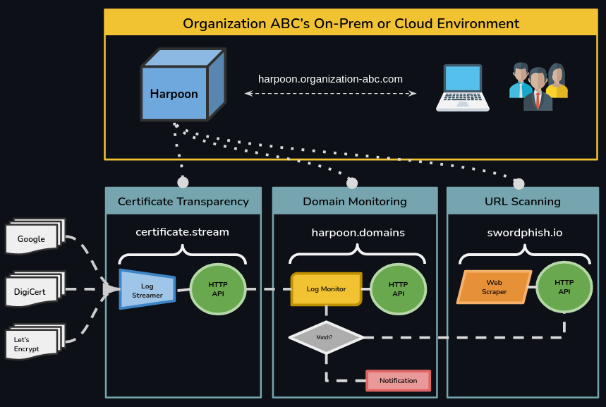

# Harpoon Domain Monitoring

<b>Need a production-ready, end-to-end Domain Monitoring solution <a href="#asset-monitoring-with-ai">powered by AI?</a></b>

Harpoon-Enterprise can sharpen your cybersecurity team's threat intelligence workflows.

## What is Harpoon-Enterprise?

### Overview

Harpoon-Enterprise extends the functionality of the [harpoon.domains](/docs/introduction-2) API service while also integrating features from other TypoVillain API Services — [certificate.stream](/docs/introduction-1) and [swordphish.io](/docs/introduction-3) — into a single user-friendly application that delivers an end-to-end robust, auditable, and efficient Domain Monitoring workflow.

Harpoon-Enterprise can ...

- Continuously monitor your organization's domain assets
- Notify your team when any new or known domains are "active"
- Scan any parked domains on a hourly or daily basis
- Monitor spam/phishing sites for your organization's logo or other assets
- Help your team work with Registrars to take down malicious domains
- Keep your organization's brand and reputation safe

### High-level Architecture

Harpoon-Enterprise is a containerized solution that can be installed onto on-prem and cloud environments using automation tools and infrastrucutre-as-code. Harpoon-Enterprise's authentication layer can hook directly into your organization's OID or LDAP services to keep access federation simple. Cybersecurity analysts can manage day-to-day operations related to domain monitoring directly within the Harpoon-Enterprise user interface. Using the application is straightforward as seen in the Demo & Walkthrough section.

## Demo & Walkthrough

This demo goes into how to set up a simple domain monitoring workflow with Harpoon-Enterprise. 

### Live Domain Monitoring

Harpoon-Enterprise can monitor your organization's domain name in real-time by comparing it to the domain names it streams from the Certificate Transparency Logs.

Simply add your company’s domain name under the "Domains" / "Domain Monitoring” heading. Behind the scenes, Harpoon uses a variety of similarity metrics to compare your domain to the domains found in the Certificate Transparency Logs. These values can be adjusted at any time to increase or decrease the number of "matches" that you see. Default values are provided for you, but you should adjust these values based on the "uniqueness" of your organization's name. 

A common question at this point is: If Harpoon is only monitoring the Certificate Transparency Logs for "New" names, then what about similar domains that are already registered? Won't Harpoon miss these?

By enabling the "Perform Active Search" option in the add monitored domain form, Harpoon will perform an "Active" search for any existing, registered domains and park them. This search includes checking all possible top level domains (.co, .net, .org, etc.) as well as common permutations (e.g. example.com -> exxample.com, exammple.com, exaple.comm).

This search typically can take up to 10 minutes to complete. An "informational" notification will be generated when the search has completed.

Nice, you have successfully added a "Monitored Domain".

### Notifications

After adding a "Monitored Domain", Harpoon will actively compare domain names found in the Certificate Transparency Logs against your monitored domain. If any similarity metric thresholds are hit, a notification will be generated. From the "Active Notifications" view you will be able to see all "unacknowledged" notifications. You can drill down into a specific notification to view information like the matched domain name, the scoring details of how it was matched, and the actual certificate where it was discovered.

:::tip
If the volume of notifications is too high (or seems too low), you should adjust the Notification Thresholds on the Monitored Domain. More information about each metric can be found embedded within the "monitored domain" edit form.
:::

Typically, clients will assign SOC Analysts to review "Active Notifications" on a regular basis. Analysts can mark obvious throwaway matches as "Acknowledged" which will remove them from the "Active" view and move them to the "All Notifications" view. More importantly, if the Analyst determines that the name seems like a typosquat of your organization’s name, they can add it to “Parked Domains” to be scanned. 

:::info
Notifications can be configured to be automatically sent to "Notification Targets", which can be either an email address or an HTTP endpoint.

These values can be configured in the UI under "Notifications" > "Notification Targets" or through runtime environment variables when the application is provisioned.
:::

### Parked Domains & URL Scanning

Now that the suspicious domain is parked, it can be scanned. Scans are queued up and processed in the background, and so you can submit multiple scans at any time. Additionally, parked domains can be assigned a "Schedule" for automated scanning. Currently, Harpoon supports Daily (triggered at 8AM EST) and Hourly (triggered at :00 every hour) scheduled scanning options.

After submitting the scan and letting it finish processing, you can view the results from the All Scans page. The Scan view is loaded with data extracted from this URL. Things like Screenshots, DNS records, WHOIS queries, HTTP traffic, and the page’s HTML are all viewable from this screen and can help you determine the true intentions of the given domain.

### Asset Monitoring with AI

What about scenarios where domain matching isn't enough? That is, what if the attacker uses a dynamic DNS service such as [duckdns.org](https://www.duckdns.org/)? How could Harpoon possibly detect these instances?

When simple word comparisons won't cut it, Harpoon uses Artificial Intelligence to fill the gap. The Harpoon platform is constantly scanning all "active" domains it finds in the Certificate Transparency Logs as well as various OSINT channels for phishing threats and updating its internal catalog with results from each scan.

With the help of Artificial Intelligence, Harpoon can quickly find web pages that appear "similar" to your website. Specifically, Harpoon will check if the given webpage is using your organization's logo or if they have copied your website under a completely different domain name. 

Using this feature is very similar to other Harpoon features. From the landing page, go to "Brands" / "Asset Monitoring" to add an asset. An "Asset" could be a screenshot of your organization's Login page or Logo. Like Monitored Domains, "Monitored Assets" can be scanned on a regular basis (On Demand, Hourly, or Daily).

Just like Amazon finds "similar" items to the one you may be looking at or Spotify finds "similar" songs to the ones you've played, Harpoon will find the 25 most "similar" images from its internal catalog of scans. 

The user interface will display these 25 similar images as a "collage" nested under the Asset show view. This makes it easy to quickly determine if any of the 25 actually contain the target Asset or not. If any of the displayed images do contain the Asset, you can drill down into the scan via the "View Scan" button. From the Asset Scan view, you can see the image as well as the domain name where it was found and "Park" the domain if it seems like a credible threat.

### Submitting Abuse Reports

Finally, if a domain discovered via an Asset scan or URL scan seem like an active, credible threat to your organization, you can log an Abuse Report with the domain registrar using the information pulled from the scan. Harpoon helps track incidents and can even integrate with ticketing systems like ServiceNow. 

## Contact

If you have any questions or are interested in using this product, please reach out to us at info@typovillain.com.

In most cases, our team can install Harpoon-Enterprise into your organization's cloud environment in about 4 to 6 weeks as well as offer ongoing support for up to 6 months post-installation.

<a className="button button--primary button--lg" href="mailto:joe@typovillain.com">Schedule Demo</a>

