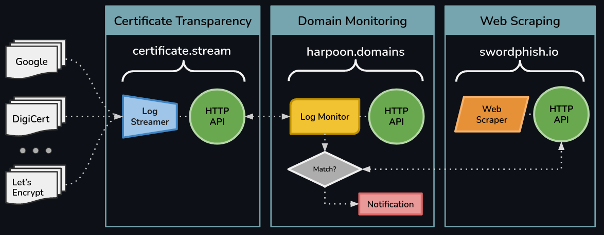

# About

## The Problem

 > "In 2021, the total number of phishing and counterfeit pages detected increased 1.5x over 2020 to a total of more than 10.5 million — and it continues to grow..." — [Security Boulevard](https://securityboulevard.com/2022/03/what-is-domain-monitoring-and-why-you-need-it/)

In today's digital world, an organization's brand identity is arguably one of its most important assets. While organizations work incredibly hard to build their brand, deliver value, and earn the trust of their customers, it is often far too easy for cyber criminals to take advantage of branding for malicious purposes. For instance in May of 2021, over [6000 Coinbase customers lost money after falling victim to a phishing campaign designed to steal customer login credentials](https://www.fool.com/the-ascent/cryptocurrency/articles/thousands-of-coinbase-users-hit-by-phishing-attack-heres-how-to-protect-yourself/). Like most phishing attacks, the criminals were able to impersonate Coinbase customer service using company branded emails; hijacking the trust that Coinbase had garnered and using it to persuade victims to navigate to a counterfeit site and divulge login information. 

> "70% of Financial Institutions lost over $500K to fraud in 2022 ..." — [CFO.com](https://www.cfo.com/technology/cyber-security-technology/2023/01/cybersecurity-fraud-lending-breach-recovery/)

Although not applicable to Coinbase, financial institutions in the United States are legally obligated to reverse any unauthorized transactions that were made as a result of the customer's account being compromised by cyber criminals as long as the victim reports the fraud within a reasonable time frame. [With an average of $136 lost per phishing attack, cyber criminals stole over $44 million dollars through phishing attacks in 2021 alone](https://aag-it.com/the-latest-phishing-statistics/). When you also consider that many financial institutions who have had their brands or likeness used in phishing emails or fictitious websites experience decreases in online account openings, this problem is not only damaging to reputation but also earnings. 

## Why it matters

> "53% of phishing sites are discovered by an external source..." — [Mandiant Security](https://www.mandiant.com/resources/reports/mandiant-security-effectiveness-report-deep-dive-cyber-reality)

With the growing importance of maintaining brand credibility, an organization's responsibility to actively monitor threats is becoming one of the top priorities for their cybersecurity department. However with the number of counterfeit pages and phishing campaigns only increasing, even the most highly skilled cybersecurity teams are finding it difficult to balance daily responsibilities with detecting these external threats.

In order to stay ahead of such threats, many organizations implement domain monitoring solutions that go above and beyond monitoring their own digital assets. For example, [typosquatting](https://en.wikipedia.org/wiki/Typosquatting) defence is now a common aspect of many cybersecurity strategies.

> "Domain monitoring entails much more than keeping an eye on registration expiry dates for the domains in your possession. Domain protection requires a domain monitoring solution that looks outside to ensure the parts you don’t use aren’t being used against you." — [Security Boulevard](https://securityboulevard.com/2022/03/what-is-domain-monitoring-and-why-you-need-it/)

Unfortunately even with a clear strategic goal in mind, architecting the right solution to protect an organization's reputation can still prove to be a challenging task. Due to time, budget, or technical constraints, many organizations can end up selecting the wrong tool, implementing the right tool but in the wrong way, or foregoing any sort of technical solution in favor of simple manual processes.

## What is Villain

### Service Overview

The Villain Toolkit consists of <u>three</u> complimentary API services for creating or enhancing domain monitoring solutions. The toolkit condenses years of cybersecurity domain expertise into a practical set of API's designed for any individual or organization to quickly and easily integrate into in-house domain monitoring cybersecurity solutions. Unlike traditional cybersecurity vendors, Villain's mission is to empower cybersecurity teams with the tools to build their own threat intelligence workflows that ...
- Integrate into existing organization-specific processes, technology stacks, and infrastructure
- Allow teams to sharpen technical and engineering skills without the need to learn one-off tools
- Close common domain monitoring gaps for a fraction of the price of traditional solutions

Together Villain's API services enable cybersecurity teams to create robust, end-to-end domain monitoring solutions. However, each of these services is capable of acting entirely independent of one another. This allows solution architects the freedom to pick and choose the APIs that best fit their particular use-case without the need to completely abandon or redesign existing workflows. 

The functionality of each API service is further examined in our [Documentation](/docs). Additionally, the [Tutorials](/about/tutorials/intro) section contains a number of example "mash-ups" of these APIs which demonstrate how to build both simple and complex end-to-end, production-ready solutions.

### Enterprise Solutions

If your team or organization is interested in Villain, but might not have the bandwidth to implement any of these services on our own, then [Harpoon-Enterprise](/about/enterprise/harpoon-enterprise) — an all-in-one solution for domain monitoring — may be the right solution. Harpoon-Enterprise is a container-based solution with a user-friendly web portal for setting up domain monitoring workflows.

### Contact

Thanks for checking out the Villain Toolkit! If you have any questions, please reach out.

— The Team at Villain
(info@villain.network)
