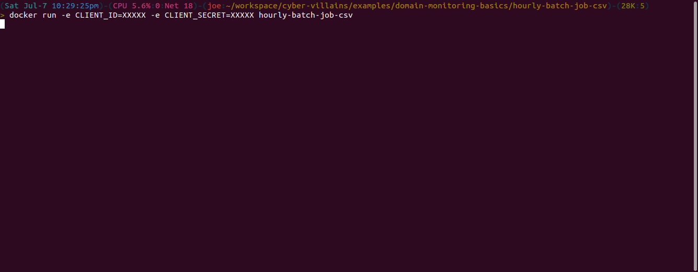
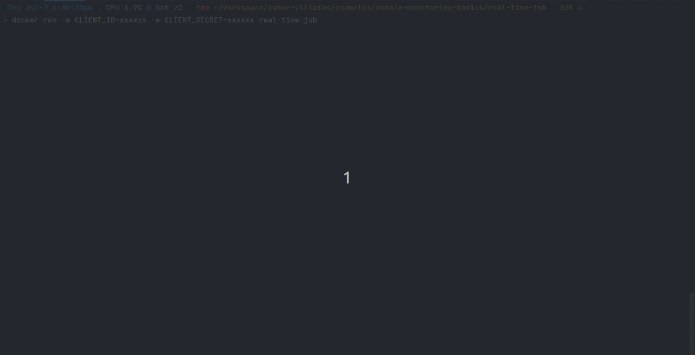

# Domain Monitoring Basics

## Overview

One of the best ways of preventing cyber criminals from spoofing your organization online [(via typosquatting)](https://en.wikipedia.org/wiki/Typosquatting), starts with [Certificate Transparency Log](https://certificate.transparency.dev/) monitoring. 

In this tutorial, you will utilize the [certificate.stream](/docs/introduction-1) API to pull domain names from the Certificate Transparency Logs in near-real-time. Additionally, we'll compare each domain to "your domain" and generate an alert if any of the domains is too similar to your own.

There are two different approaches presented below, an hourly batch job and a real-time job. Both accomplish the same goal and share much of the same code, but one may be preferred over the other in certain circumstances. Details are examined in each section.

## Hourly Batch Job

The hourly batch job will poll the [certificate.stream](/docs/get-domains-csv-file) API every hour for domain names found in the Certificate Transparency Logs. This job will also check how similar each domain name is to `YOUR_DOMAIN`, a domain name that you want monitored.

➤ [Full source code](https://github.com/cyber-villains/examples/tree/main/domain-monitoring-basics/hourly-batch-job-csv)

### Pros and Cons

| Pros | Cons |
| --------------------------------- | --------------------------------- |
| <ul><li>An "event-driven" approach means lower costs, predictable executions</li><li>It is easier to audit and replay past events in case of unexpected downtime</li></ul> | <ul><li>The response to a true positive can be delayed by up to one hour</li></ul> |

### Walkthrough

There are two variables that can be configured when running this script. The first variable is `YOUR_DOMAIN` in `main.py`. This is the domain name the script will use for performing similarity comparisons with what's found in certificate transparency logs. The second is `date_and_hour`. This is the specific hour for which you want to retrieve domains. If you don't specify a `date_and_hour`, the endpoint will use the previous hour. In the event you need to check previous dates, you can specify any date and hour from the past 30 days.

```python title="domain-monitoring-basics/hourly-batch-job-csv/main.py"
from monitor import monitor_hourly

YOUR_DOMAIN = "examplecompany.com"


if __name__ == "__main__":
    # TODO: you could use command line arguments to set date_and_hour (or even YOUR_DOMAIN)!

    # **Note**
    # To ensure consistency around handling late arriving data, the CSV file
    # for previous hour is available at the earliest 5 minutes after the hour.
    # That is, the domains from the hour 5:00AM-6:00AM would available at 6:05AM.
    date_and_hour = None  # If None, will use the last hour.

    monitor_hourly(YOUR_DOMAIN, date_and_hour)
```

Let's dive into the details of the script by looking at the entrypoint function, `monitor_hourly`. This function sets up the main components of the job: authentication, requesting the CSV file, and domain name processing. 

```python title="domain-monitoring-basics/hourly-batch-job-csv/monitor.py
def monitor_hourly(your_domain: str, date_and_hour: str) -> None:
    # get an access token
    token = get_token(client_id, client_secret)
    # check if date_and_hour was given
    if date_and_hour is None:
        date_and_hour = get_previous_date_and_hour_utc()
    # process the last hour of domains
    domains_csv = get_domains_csv_streamer(token, date_and_hour)
    header_row = True
    for row in domains_csv:
        # skip header row
        if header_row:
            header_row = False
            continue
        # handle each row
        process_csv_row(your_domain, row)
```

There's a lot going on in this block, and so, we'll breakdown it down over the next few sections.

The first thing the script does is obtain an ["access token"](/docs/introduction) from the token endpoint using the client id and secret. Be aware that the values for these variables are set globally and actually read from the environment at runtime. If you're running these examples using Docker or another container management tool, be sure to check out the README for information on how to pass these values to the container at run time.

```python title="domain-monitoring-basics/hourly-batch-job-csv/monitor.py"
client_id = os.getenv("CLIENT_ID")
client_secret = os.getenv("CLIENT_SECRET")
```

Next, there is a check for `date_and_hour`. If this parameter is null, the script will get the value for previous hour via the `get_previous_date_and_hour_utc()` function. This function is shown below. Although obvious, it is important to point out the fact that the return value from this function is dependent on "when" it is run.

```python title="domain-monitoring-basics/hourly-batch-job/monitor.py"
def get_previous_date_and_hour_utc():
    dt = datetime.datetime.utcnow()
    # get last hour
    dt = dt - datetime.timedelta(hours=1)
    return dt.strftime("%Y-%m-%d-%H")  # should look like "2023-06-01-16"
```

After obtaining a valid `token` and `date_and_hour` if you supplied one, we can pass these values to the `get_domains_csv_streamer` function. This function will make a request to the certificate.stream API's [hourly domain CSV endpoint](/docs/get-domains-csv-file). The response from this endpoint is a CSV file containing all of the domains from the past hour. This CSV is usually between 200MB - 300MB, so we "stream" the response line by line using the `requests` library in order to avoid reading the whole file into memory.

```python title="domain-monitoring-basics/hourly-batch-job-csv/api.py"
def get_domains_csv_streamer(token: str, date_and_hour: str):
    url = f"{BASE_URL}/domains/csv"
    params = {"date_and_hour": date_and_hour}
    headers = {"Authorization": f"Bearer {token}", "Accept": "application/json"}
    sess = requests.Session()
    with sess.get(url, headers=headers, params=params, stream=True) as response:
        for line in response.iter_lines():
            yield line
```

:::info
[certificate.stream's](/docs/get-domains-csv-file) CSV endpoint returns a redirect to the physical CSV file. If you choose to adapt this example to your preferred programming language or HTTP libraries, you should ensure that your HTTP client is configured to follow redirects if it is not doing so by default.
:::

Now, all that is left to do is process each row of the CSV file. As its name implies, the `process_csv_row` function will handle parsing an individual line from the CSV file.

```python title="domain-monitoring-basics/hourly-batch-job-csv/monitor.py"
def process_csv_row(your_domain: str, row: bytes) -> None:
    # decode and split row by comma
    data = row.decode().split(",")
    # domain_name is the first column
    ct_log_domain = data[0]
    # compare the ct_log_domain to your_domain
    value = metric(your_domain, ct_log_domain)
    # if the similarity threshold is exceeded, create alert!
    if value < MINIMUM_THRESHOLD:
        alert(your_domain, ct_log_domain)
    else:
        logger.info(f"{ct_log_domain} is NOT similar to {your_domain} ...")
```

In this example, the `metric` and `alert` functions (and the `MINIMUM_THRESHOLD` variable) are more or less "stubs" that you should modify to meet your needs. For example, you may be interested in applying more complex similarity metrics to `your_domain` and the domains from the logs. Additionally, alerts in your workflow could take the form of emails, ticketing systems, or more API calls to different services. All of these decisions are important for you and your team to make in order to build a solid solution. If you're interested in hearing about how we've helped other organizations configure these components, send us an email or check out [harpoon.domains](/docs/introduction-2).

```python title="domain-monitoring-basics/hourly-batch-job-csv/monitor.py"
# todo: Adjust your threshold based on your metrics
MINIMUM_THRESHOLD = 2


def alert(your_domain: str, ct_log_domain: str) -> None:
    # todo: Add your own alerting here!
    logger.info(f"Heads up! {ct_log_domain} is very similar to {your_domain} ...")
    return None


def metric(your_domain: str, ct_log_domain: str) -> float:
    # todo: Add your own similarity metrics/functions here!
    distance = td.levenshtein(your_domain, ct_log_domain)
    return distance
```

... and that's all the code for the hourly batch job! You're now familiar with how the certificate.stream API can help you create a simple domain monitoring workflow. 

### A Real Batch Run

Here's what a real run looks like locally using Docker.



Again, please feel free to clone the code, make modifications, and build something awesome!

## Real-time Monitoring

The real-time monitoring job will poll the [certificate.stream](/docs/introduction-1) API continously for new domain names found in the Certificate Transparency Logs. This job will also check how similar each domain name is to YOUR_DOMAIN, a domain name that you want monitored.

➤ [Full source code](https://github.com/cyber-villains/examples/tree/main/domain-monitoring-basics/real-time-job)

### Pros and Cons

| Pros | Cons |
| --------------------------------- | --------------------------------- |
| <ul><li>Minimal delay between identifying and reacting to a true positive</li></ul> | <ul><li>"Always On" architecture means higher costs to maintain</li><li>Additional logic may be needed to minimize Recovery Point Objective in case of downtime</li></ul> |

### Walkthrough

A majority of the code for the Real-time Monitoring example is identical to the Hourly Batch Job, so we'll skip over some of the logic that was covered in the Batch Job tutorial, and instead, focus on the differences.

First, the entrypoint for the Real-time Monitoring job is adjusted to "run forever" (`while True`):

```python title="domain-monitoring-basics/real-time-job/monitor.py"
def monitor_continuously(domain_name: str) -> None:
    # get an access token
    token = get_token(client_id, client_secret)
    # set start id to null, so we begin with the latest domains
    start_id = None
    # run forever
    while True:
        try:
            # update start_id to request the latest domains
            start_id = monitor_domains(domain_name, token=token, start_from_id=start_id)
            # pause for a second to avoid rate-limit errors
            logger.info("Waiting 1 second(s) before fetching next batch.")
            time.sleep(1.0)

        except requests.exceptions.HTTPError as e:
            # catch expired token errors
            if e.response.status_code in [401, 403]:
                # get a new token and retry
                token = get_token(client_id, client_secret)
            else:
                raise e
```

In this case, we're not concerned with pulling the data for a particular hour, but instead want to continously pull the latest domains as they are recorded by certificate.stream's log monitor. This is achieved via the `start_from_id` parameter. This parameter controls where the internal "query" for domains from the certificate transparency log will start, and so, the code will update this parameter after each consecutive call. You'll notice that there is an "if" check, `if len(domains_response["domains"]) == 0:`, which is determining whether there were any "new" domains from the previous call. Because this method is "near real-time" (certificate.stream processes logs in ~30 second microbatches behind the scenes), there are brief periods where there may be no "new" domains recorded. In these cases, we just return the same `start_from_id`, wait a second, and retry the same API call.

```python title="domain-monitoring-basics/real-time-job/monitor.py
@retry_auth_failures()
def monitor_domains(domain_name: str, token: str, start_from_id: str = None) -> str:
    # url params
    params = {"limit": 1000}
    if start_from_id is not None:
        params["start_from_id"] = start_from_id

    # make request for domains
    domains_response = get_domains(token, params)

    # make sure there were new domains
    if len(domains_response["domains"]) == 0:
        # nothing new, return the same starting id
        logger.info(f"The latest start_from_id did not change...")
        return start_from_id

    # check the domains
    check_domains(domains_response["domains"], domain_name)
    
    # all latest domains from the last request have now been checked,
    # and alerts generated for any that were similar to your_domain

    # return the last id to be used as the `start_from_id`
    # in next the function call
    next_start_id = domains_response["domains"][-1]["id"]
    return next_start_id
```

Finally besides the `start_from_id` parameter, the other area where this code differs is with authentication. Because this job has an indefinite runtime, the initial access token will eventually expire and cause "Access Denied" exceptions. To remedy this situation, the code within the `while` loop is wrapped in a try/except block, which will request another valid token.

### A Real Continuous Run

Here's what a real run looks like locally using Docker.



That's it! You're now familiar with how the real-time job works. 

Again, please feel free to clone the code, make modifications, and build something awesome!

