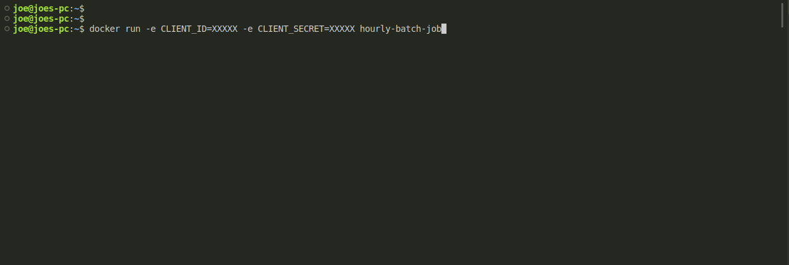
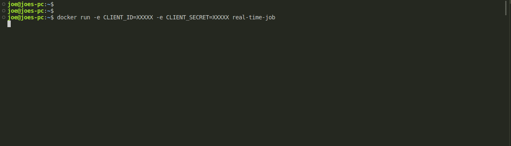

# Domain Monitoring Basics

## Overview

One of the best ways of preventing cyber criminals from spoofing your organization online [(via typosquatting)](https://en.wikipedia.org/wiki/Typosquatting), starts with [Certificate Transparency Log](https://certificate.transparency.dev/) monitoring. 

In this tutorial, you will utilize the [certificate.stream](/docs/introduction-1) API to pull domain names from the Certificate Transparency Logs in near-real-time. Additionally, we'll compare each domain to "your domain" and generate an alert if any of the domains is too similar to your own.

There are two different approaches presented below, an hourly batch job and a real-time job. Both accomplish the same goal and share much of the same code, but one may be preferred over the other in certain circumstances. Details are examined in each section.

## Hourly Batch Job

The hourly batch job will poll the [certificate.stream](/docs/introduction-1) API every hour for domain names found in the Certificate Transparency Logs. This job will also check how similar each domain name is to `your_domain`, a domain name that you want monitored.

[Full source code](https://github.com/cyber-villains/examples/domain-monitoring-basics)

### Pros and Cons

| Pros | Cons |
| --------------------------------- | --------------------------------- |
| <ul><li>An "event-driven" approach means lower costs, predictable executions</li><li>It is easier to audit and replay past events in case of unexpected downtime</li></ul> | <ul><li>The response to a true positive can be delayed by up to one hour</li></ul> |

### Walkthrough

The most important, configurable argument to this example is `YOUR_DOMAIN` in `main.py`. This is the domain name the script will use for performing similarity comparisons on what's found in certificate transparency logs.

```python title="domain-monitoring-basics/hourly-batch-job/main.py"
from monitor import monitor_previous_hour

# This is the domain name that you want monitored!
YOUR_DOMAIN = "examplecompany.com"


if __name__ == "__main__":
    # TODO: you could use command line arguments to set date_and_hour
    # None is a valid value, monitor_previous_hour can handle populating it
    date_and_hour = None  
    monitor_previous_hour(YOUR_DOMAIN, date_and_hour=date_and_hour)

```

Let's dive into the heart of the script by looking at the entrypoint for the hourly batch job, `monitor_previous_hour`. This function sets up the main components of the job: authentication and domain name processing. 

```python title="domain-monitoring-basics/hourly-batch-job/monitor.py"
def monitor_previous_hour(domain_name: str, date_and_hour: str = None) -> None:
    # get an access token
    token = get_token(client_id, client_secret)
    # check if date_and_hour was given
    if date_and_hour is None:
        date_and_hour = get_previous_date_and_hour_utc()
    # process the last hour of domains
    monitor_domains(domain_name, token, date_and_hour)
    logger.info(f"Finished monitoring domains from {date_and_hour}.")
    return
```

The first thing the script does is obtain an ["access token"](/docs/introduction). The client id and secret are used to request a token from the token endpoint. Be aware that the values for these variables are set globally and actually read from the environment at runtime. If you're running these examples using Docker or another container management tool, be sure to check out the README for information on how to pass these values to the container at run time.

```python title="domain-monitoring-basics/hourly-batch-job/monitor.py"
client_id = os.getenv("CLIENT_ID")
client_secret = os.getenv("CLIENT_SECRET")
```

Next, there is a check for `date_and_hour`. If this parameter is null, the script will get the value for previous hour via the `get_previous_date_and_hour_utc()` function. This function is shown below. Although obvious, it is important to point out the fact that the return value from this function is dependent on "when" it is run.

```python title="domain-monitoring-basics/hourly-batch-job/monitor.py"
def get_previous_date_and_hour_utc():
    dt = datetime.datetime.utcnow()
    # get last hour
    dt = dt - datetime.timedelta(hours=1)
    return dt.strftime("%Y-%m-%d-%H")  # should look like "2023-06-01-16"
```

Now `your_domain`, `token`, and `date_and_hour` are passed to `monitor_domains` where a bulk of the logic is contained. The function has comments that outline what is happening line by line, but at a high level, this function is making API calls to certificate.stream (`get_domains`) and processing the results one by one (`check_domains`).

```python title="domain-monitoring-basics/hourly-batch-job/monitor.py"
def monitor_domains(your_domain: str, token: str, date_and_hour: str) -> None:
    # define url params
    params = {
        "limit": 1000,  # Fetch batches of 1000 domains at a time.
        "offset": 0,
        "date_and_hour": date_and_hour,
    }
    # make initial request for domains
    domains_response = get_domains(token, params)
    # domains_response schema: https://villain.network/docs/list-latest-domains

    # `count` is the total number of domains from the past hour
    count = domains_response["count"]
    logger.info(f"There are a total of {count} domains from the past hour.")

    # the offset used for this page of results (0)
    offset = domains_response["offset"]

    # check the first batch of domains
    check_domains(domains_response["domains"], your_domain)
    logger.info(f"Finished checking {offset+1000}/{count} domains.")

    # the `/list` endpoint uses offset-based pagination, so
    # we'll continue making calls with the offset parameter
    # until all domains from the past hour have been processed
    while (offset + 1000) < count:
        # update offset and re-request data
        offset += 1000
        params["offset"] = offset
        domains_response = get_domains(token, params)
        # check the domains
        check_domains(domains_response["domains"], your_domain)
        logger.info(f"Finished checking {offset}/{count} domains.")

    # all domains from the previous hour have now been checked
    # and alerts generated for any that were similar to your_domain
    return
```

The `get_domains` function will make a request to the certificate.stream API using the given token. If there is any bad response (400s or 500s status code), this function will raise an exception. Otherwise, the response is returned as a python dictionary. Note that ["offset-based pagination"](https://developer.box.com/guides/api-calls/pagination/offset-based/) is used for retrieving results as the number of domain names extracted per hour is too large to fit into a single response (we pull about 6GB of raw certificate data per hour). Therefore, it takes multiple API calls (hence the `while` loop in `monitor_domains`) to retrieve the entire set of data for the past hour.

```python title="domain-monitoring-basics/hourly-batch-job/api.py"
def get_domains(token: str, params: dict) -> dict:
    url = f"{BASE_URL}/domains/list"
    headers = {"Authorization": f"Bearer {token}", "Accept": "application/json"}
    response = requests.request("GET", url, headers=headers, params=params)
    response.raise_for_status()
    return response.json()
```

The `check_domains` function will iterate over the fetched domains in each batch. In this example, the `metric` and `alert` functions (and the `MINIMUM_THRESHOLD` variable) are more or less "stubs" that you should modify to meet your needs. For example, you may be interested in applying more complex similarity metrics to `your_domain` and the domains from the logs. Additionally, alerts in your workflow could take the form of emails, ticketing systems, or more API calls to different services. All of these decisions are important for you and your team to make in order to build a solid solution. If you're interested in hearing about how we've helped other organizations configure these components, send us an email or check out [harpoon.domains](/docs/introduction-2).

```python title="domain-monitoring-basics/hourly-batch-job/monitor.py"
def check_domains(domains: list, your_domain: str) -> None:
    # iterate through the domains returned from certificate.stream
    for domain_obj in domains:
        # compare each to your_domain
        ct_log_domain = domain_obj["domain_name"]
        value = metric(your_domain, ct_log_domain)
        # if the similarity threshold is exceeded, create alert!
        if value < MINIMUM_THRESHOLD:
            alert(your_domain, ct_log_domain)
        else:
            logger.info(f"Ok. {ct_log_domain} is NOT similar to {your_domain} ...")

```

### A Real Batch Run

Here's what a real run looks like locally using Docker.



That's it! You're now familiar with how the batch job works. 

Again, please feel free to clone the code, make modifications, and build something awesome!

## Real-time Monitoring

[Source code](https://github.com/cyber-villains/examples/domain-monitoring-basics)

### Pros and Cons

| Pros | Cons |
| --------------------------------- | --------------------------------- |
| <ul><li>Minimal delay between identifying and reacting to a true positive</li></ul> | <ul><li>"Always On" architecture means higher costs to maintain</li><li>Additional logic may be needed to minimize Recovery Point Objective in case of downtime</li></ul> |

### Walkthrough

A majority of the code for the Real-time Monitoring example is identical to the Hourly Batch Job, so we'll skip over some of the logic that was covered in the Batch Job tutorial, and instead, focus on the differences.

First, the entrypoint for the Real-time Monitoring job is adjusted to "run forever" (`while True`):

```python title="domain-monitoring-basics/real-time-job/monitor.py"
def monitor_continuously(domain_name: str) -> None:
    # get an access token
    token = get_token(client_id, client_secret)
    # set start id to null, so we begin with the latest domains
    start_id = None
    while True:
        # update start_id to request the latest domains
        start_id = monitor_domains(domain_name, token=token, start_from_id=start_id)
        # pause for a second to avoid rate-limit errors
        logger.info("Waiting 1 second(s) before fetching next batch.")
        time.sleep(1.0)
```

In this case, we're not concerned with pulling the data for a particular hour, but instead want to continously pull the latest domains as they are recorded by certificate.stream's log monitor. This is achieved via the `start_from_id` parameter. This parameter controls where the internal "query" for domains from the certificate transparency log will start, and so, the code will update this parameter after each consecutive call. You'll notice that there is an "if" check, `if len(domains_response["domains"]) == 0:`, which is determining whether there were any "new" domains from the previous call. Because this method is "near real-time" (truthfully, things are happening in ~30 second microbatches behind the scenes), there are brief periods where there may be no "new" domains recorded. In these cases, we just return the same `start_from_id`, wait a second, and retry the same API call.

```python title="domain-monitoring-basics/real-time-job/monitor.py
@retry_auth_failures()
def monitor_domains(domain_name: str, token: str, start_from_id: str = None) -> str:
    # url params
    params = {"limit": 1000}
    if start_from_id is not None:
        params["start_from_id"] = start_from_id

    # make request for domains
    domains_response = get_domains(token, params)

    # make sure there were new domains
    if len(domains_response["domains"]) == 0:
        # nothing new, return the same starting id
        logger.info(f"The latest start_from_id did not change...")
        return start_from_id

    # check the domains
    check_domains(domains_response["domains"], domain_name)

    # all latest domains from the last request have now been checked,
    # and alerts generated for any that were similar to your_domain

    if start_from_id is None:
        # if this is the "first" call, return the last id to be used
        # as the `start_from_id` in next the function call
        next_start_id = domains_response["domains"][0]["id"]
    else:
        # otherwise, use the last id as parameter to the next call
        next_start_id = domains_response["domains"][-1]["id"]

    return next_start_id
```

Besides the `start_from_id` difference, the other area where this code differs is with authentication. Because this job has an indefinite runtime, the initial access token will eventually expire and cause "Access Denied" exceptions. To remedy thi situation,
the `monitor_domains` function is wrapped in the decorator, `retry_auth_failures`. Decorators - or closures as they're called in different programming languages - are a pythonic way to wrap the execution of a function in another function. In this case, the `retry_auth_failures` will "catch" any Access Denied exceptions, retrieve a fresh access token, and retry the function.

```python title="domain-monitoring-basics/real-time-job/monitor.py
def retry_auth_failures():
    def fn(func):
        @wraps(func)
        def wrapper(*args, **kwargs):
            try:
                result = func(*args, **kwargs)
                return result
            except requests.exceptions.HTTPError as e:
                # catch expired token errors
                if e.response.status_code in [401, 403]:
                    # get a new token and retry
                    token = get_token(client_id, client_secret)
                    kwargs["token"] = token
                    return func(*args, **kwargs)
                else:
                    raise e

        return wrapper

    return fn
```
... And that's pretty much the big differences between these two methods!

### A Real Continuous Run

Here's what a real run looks like locally using Docker.



That's it! You're now familiar with how the real-time job works. 

Again, please feel free to clone the code, make modifications, and build something awesome!

